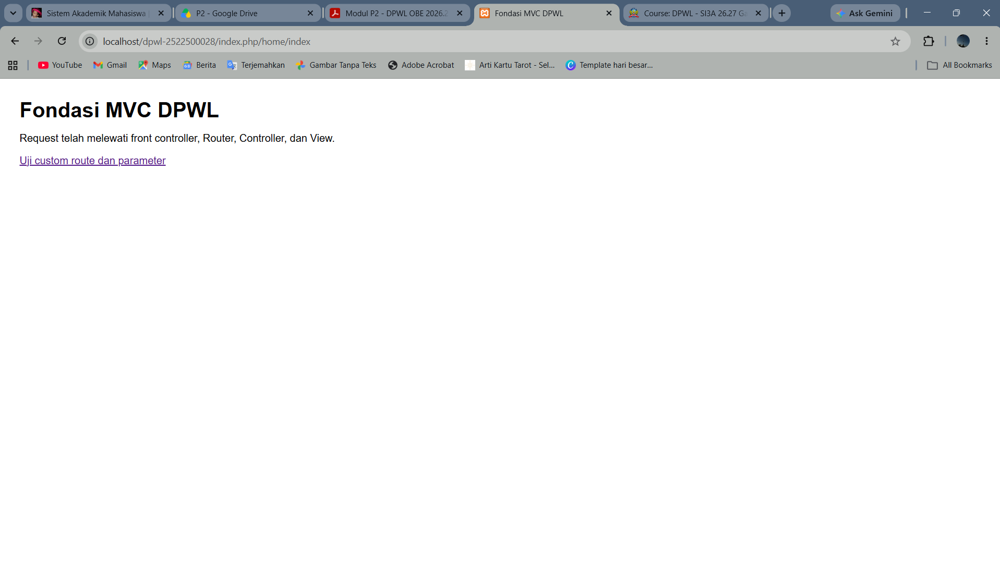
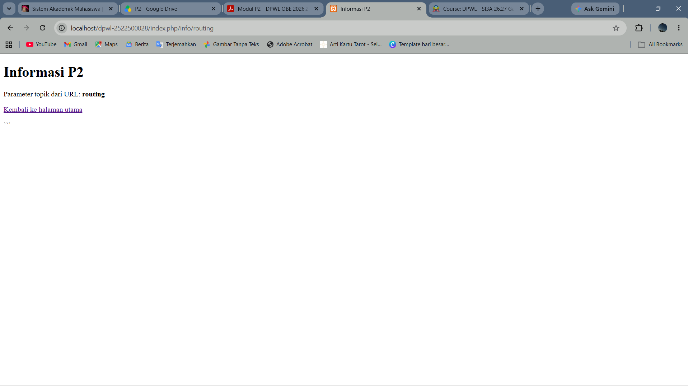

# Pertemuan 02 - Fondasi MVC Buatan Sendiri

## 1. Tujuan Praktikum
- Menjelaskan fungsi front controller, routing, Base URL, dan Helper dalam aplikasi MVC
- Merancang struktur direktori MVC beserta fungsi komponennya.
- menjelaskan alur request-response melalui front controller,routing, controller, model dan view pada implementasi P2
- Merancang pemetaan URL / route ke Controller, method / action, dan parameter. 
- Merancang penggunaan Base URL dan Helper untuk URL, navigasi, aset, dan fungsi pendukung. 
- Menjelaskan interaksi antarkomponen MVC berdasarkan rancangan yang diberikan. 
- Menyusun kerangka awal proyek MVC serta mendokumentasikan perkembangannya melalui pertemuan02/README.md dan Git/GitHub

## 2. Struktur Direktori
BASE: C:\laragon\www\dpwl-2522500028
├─ application
│  ├─ config
│  │  ├─ config.php
│  │  └─ routes.php
│  ├─ controllers
│  │  └─ home.php
│  ├─ helpers
│  │  └─ url_helper.php
│  └─ views
│     └─ home
│        ├─ index.php
│        └─ info.php
├─ assets
│  └─ css
│     └─ app.css
├─ generatestrukturdirektorifile.php
├─ index.php
└─ system
   └─ core
      ├─ Controller.php
      └─ Router.php
Penjelasan:
- config.php digunakan untuk konfigurasi dasar aplikasi
- routes.php digunakan untuk menentukan URL tertentu akan diarahkan ke controller dan method mana.
- home.php digunakan untuk menerima request dan menentukan apa yang harus dilakukan.
- url_helper.php berisi fungsi yang dapat digunakan berulang kali.
- index.php digunakan untuk menampilkan data html kepada pengguna.
- info.php duginakan untuk menampilkan parameter.
- app.css digunakan untuk mempercantik atau mengatur tampilarolln halaman.
- index.php digunakan untuk membantu membuat struktur folder/file.
- Congroller.php digunakan untuk menyediakan method dan merupakan induk/base class dari controller aplikasi.
- Router.php digunakan untuk membaca URL dan menentukan controller, method, serta parameter yang harus di jalankan.

## 3. Front controller
sebagai satu titik masuk utama aplikasi. Setiap request atau permintaan halaman dari browser akan masuk terlebih dahulu melalui index.php sebelum diteruskan ke bagian lainnya.

## 4. Routing dan Pemetaan URL
| URL/Route | Controller | Method | Parameter | View |
|---|---|---|---|---|
| / | Home | index | - | home/index.php |
| home/index | Home | index | - | home/index.php |
| home/info/mvc | Home | info | mvc | home/info.php |
| info/routing | Home | info | routing | home/info.php | 
| home/info/dpw |Home | info | dpw | home/info.php |
penjelasan: 
home/info/dpw: Route ini menggunakan Controller Home, karena bagian pertama URL adalah Home. Selanjutnya bagian info menunjukkan method info() yang terdapat di dalam Controller Home. bagian dpw merupakan parameter yang dikirim ke method tersebut.

## 5. Base URL dan Helper
base_url() digunakan untuk mendapatkan alamat dasar (URL utama) aplikasi. biasanya berfungsi untuk memanggil file yang bersifat static, contohnya CSS, JavaScript, gambar, font dan lain lainnya

site_url() digunakan untuk membentuk url menuju route aplikasi. contohnya route: home/index.
contoh iplementasi pada pertemuan 2 yaitu: Misalnya pada application/views/home/index.php:
base_url('assets/css/app.css') 
site_url('home/info/mvc')

## 6. Alur Request-response
Jelaskan dua alur berikut:
1. Alur eksekusi aktual P2:
Browser → index.php → Router → Controller → View → Response.
penjelasan:
browser: Browser mengirimkan request (permintaan) ke server.
index.php: File index.php berperan sebagai Front Controller, yaitu satu pintu masuk utama aplikasi.
Di dalamnya, aplikasi memuat konfigurasi, helper, Controller, dan Router.
Router: Router kemudian meneruskan request tersebut ke Controller yang sesuai.
Controller: Controller bertugas mengatur proses dan menentukan View mana yang harus ditampilkan.
View: View bertugas menghasilkan tampilan HTML yang akan dilihat oleh pengguna.
Response: Setelah View menghasilkan HTML, HTML tersebut dikirim kembali ke browser sebagai response (balasan).

2. Posisi Model dalam arsitektur MVC lengkap:
Browser → index.php → Router → Controller → Model → basis data/data → Model → Controller → View →
Response.
Penjelasan:
browser: Browser mengirimkan request (permintaan) ke server.
index.php: File index.php berperan sebagai Front Controller, yaitu satu pintu masuk utama aplikasi.
Di dalamnya, aplikasi memuat konfigurasi, helper, Controller, dan Router.
Router: Router kemudian meneruskan request tersebut ke Controller yang sesuai.
Controller: Controller bertugas mengatur proses dan menentukan View mana yang harus ditampilkan.
Modal: Model melakukan proses pengambilan data dari basis data.
basis data/data: Basis data mengembalikan data.
Model: Model menerima dan mengolah data tersebut, kemudian mengembalikannya ke Controller.
Controller: Controller menerima data dari Model dan mengirimkannya ke View.
View: Controller menerima data dari Model dan mengirimkannya ke View.
Response: HTML dikirim kembali ke browser.

## 7. Hasil Pengujian dan Debugging
Berdasarkan hasil implementasi P2, aplikasi dapat berjalan sesuai yang diharapkan. Pemeriksaan sintaks menggunakan PHP CLI menunjukkan hasil **“No syntax errors detected”**, sehingga tidak ditemukan kesalahan pada kode PHP yang diperiksa.

Pengujian juga dilakukan pada beberapa route, seperti `/`, `home/index`, `home/info/mvc`, `info/routing`, dan `home/info/dpw`. Semua route berhasil menampilkan halaman sesuai dengan Controller, Method, Parameter, dan View yang telah ditentukan. Dengan demikian, implementasi P2 dinyatakan berhasil.

## 8. Bukti Tangkapan Layar
Sisipkan gambar yang relevan dari folder dokumentasi/ dengan perintah:
### Gambar 1. Hasil Pengujian Halaman Utama

### Gambar 2. Hasil Pengujian Custom Route

## 9. Kesimpulan P2
Pada P2, kerangka **MVC** sudah dapat mengatur alur aplikasi melalui **Front Controller, Router, Controller, dan View**. Pada P3, akan ditambahkan **Model dan database** serta pengembangan fitur agar aplikasi lebih dinamis.
